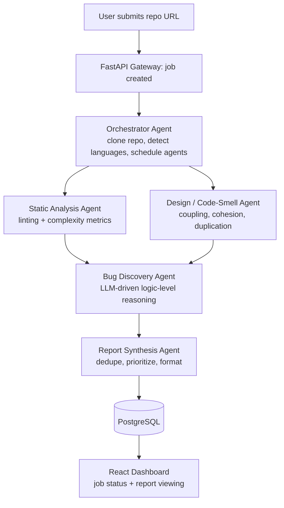

# Watchdog 

**An autonomous multi-agent system that reviews any public GitHub repository and produces structured, prioritized bug reports — no human reviewer required to initiate or guide the process.**

Watchdog treats code review as a pipeline problem, not a single-prompt problem. A user submits a repo URL; a coordinated team of specialized agents clones it, statically analyzes it, assesses design quality, reasons about logic-level bugs a linter can't catch, and synthesizes everything into a single structured report — the way a real engineering team distributes review responsibilities across specialists, rather than one person (or one model call) trying to do it all.

---

## Why Watchdog

Code review is one of the most effective safeguards against software defects, and one of the hardest practices to scale:

- **Reviewer bandwidth is a bottleneck.** The engineers most qualified to review are also the most time-constrained.
- **Review quality is inconsistent.** It varies with reviewer fatigue, familiarity, and time pressure.
- **Existing tools are split into two weak categories** — static analyzers that flag surface-level issues but can't reason about intent, and AI code assistants that reason well but only interactively, one file or one prompt at a time, with no systematic, repo-wide process.

Watchdog combines both: systematic static analysis *and* AI-driven logical reasoning, in a single pipeline that a developer points at a full repository and gets back a structured, actionable report.

---

## Key Capabilities

-  **Submit any public GitHub repo URL** for analysis — no setup required on the target repo.
-  **Automated static analysis** — complexity, style, and lint-level issues across supported languages.
-  **Design-quality assessment** — coupling, cohesion, code duplication, and long-method/class smells.
-  **AI-driven logic-level bug discovery** — null-handling gaps, off-by-one errors, unhandled edge cases, and likely race conditions that static tools can't catch.
-  **Structured bug reports** — title, severity, affected file/line, description, and suggested fix per finding.
-  **Job history dashboard** to revisit past analyses of a repository.
-  **Asynchronous processing** so large repositories don't block the interface.

---

## Architecture

Watchdog is a multi-agent pipeline coordinated by a central orchestrator. Each agent is a specialized, independently testable unit with a single responsibility, communicating through a shared job context rather than being tightly coupled to one another.

**Agent pipeline:**

| Agent | Responsibility |
|---|---|
| **Orchestrator** | Clones the repo, detects languages/project structure, schedules downstream agents |
| **Static Analysis** | Runs language-appropriate linters and complexity tools (e.g. Pylint/Radon, ESLint), normalizes output |
| **Design & Code-Smell** | Evaluates coupling, cohesion, duplication, and long-method/class smells |
| **Bug Discovery** | LLM-driven; reads flagged functions/files in context and reasons about logic errors static tools miss |
| **Report Synthesis** | Aggregates all upstream findings, deduplicates, assigns severity, formats the final report |

Static Analysis and Design/Code-Smell run in parallel; Bug Discovery consumes both outputs before Report Synthesis produces the final result.

---

## Tech Stack

| Layer | Technology |
|---|---|
| Frontend | React, served via S3 + CloudFront |
| Backend API | Python, FastAPI |
| Agent Orchestration | LangGraph / CrewAI |
| Compute | AWS ECS Fargate (agent workers), AWS Lambda (lightweight API handlers) |
| Queue | AWS SQS (job decoupling, so long-running jobs don't block the API) |
| Database | AWS RDS (PostgreSQL) |
| Repo Ingestion | GitHub REST API, `git clone` into ephemeral container storage |
| CI/CD | GitHub Actions → Docker → ECS deployment |
| Infrastructure as Code | Terraform, version-controlled alongside application code |
| Auth | GitHub OAuth |

---

## Deployment Topology

- **Frontend:** static React build on S3, distributed via CloudFront.
- **Backend API:** containerized FastAPI service on ECS Fargate behind an Application Load Balancer.
- **Agent workers:** separate ECS Fargate task definitions, scaled independently from the API based on SQS queue depth.
- **Database:** managed PostgreSQL via RDS with automated backups.
- **Secrets:** AWS Secrets Manager — never committed to source control.

Every merge to `main` triggers a GitHub Actions workflow that builds Docker images per service, pushes to Amazon ECR, and deploys updated task definitions to ECS.

---

## Testing Strategy

| Level | Scope | Tooling |
|---|---|---|
| Unit | Individual agent logic in isolation, mocked LLM/API responses | PyTest |
| Integration | Agent-to-agent hand-off through the orchestrator | PyTest + fixtures |
| End-to-End | Full pipeline against small reference repos with known, seeded bugs | Custom test harness |
| Regression | Re-run reference repos on every merge to confirm report quality doesn't degrade | CI-integrated |

A small set of reference repositories with deliberately seeded bugs is maintained as a regression benchmark, used to track the Bug Discovery Agent's precision and recall across development iterations.

---

## Risk Management

| Risk | Mitigation |
|---|---|
| LLM API cost overrun from public usage | Per-user rate limiting, repo size caps, optional bring-your-own-key mode |
| Cloning malicious/oversized repositories | Size limits, sandboxed ephemeral storage, automatic cleanup |
| Agent output inconsistency | Structured output schemas enforced at every agent boundary, validated before hand-off |
| Long-running jobs blocking the API | Asynchronous, queue-based processing with job polling |
| Scope creep across many languages | MVP scoped to one to two languages before expanding |

---

## Target Users

- Individual developers and open-source maintainers wanting an automated first-pass review.
- Student and academic projects seeking baseline code-quality feedback.
- Engineering teams evaluating Watchdog as a pre-review triage layer ahead of human review.

---

## Status

Built for **BCSE301L — Software Engineering**, VIT Chennai (Faculty: Dr. Prabhakaran R), developed via an Agile, sprint-based process across six two-week sprints — from an orchestrator skeleton through full deployment and hardening. Deployed as a public, cloud-hosted web application.
